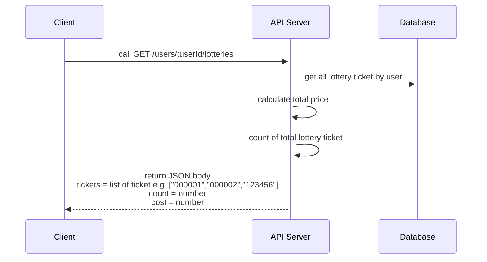

# Lottery Ticket System
The banking application aims to enhance user experience by enabling users to conveniently purchase lottery tickets. This feature targets the modern generation of lottery enthusiasts who seek convenience and freedom from the hassle of physically managing lottery tickets. Additionally, it facilitates easy fund transfers through the application.

## Features
1. Admin Functionality:
   - Admins can add lottery numbers consisting of 6 digits.
   - Admin features require privilege verification before access.
2. User Functionality:
   - Users can view a list of all available lottery numbers.
   - Users can purchase lottery tickets.
   - Users can view a list of purchased lottery tickets, along with a summary of the total amount spent.
   - Users can return purchased lottery tickets
3. Payment Handling:
   - Users are not burdened with upfront payments, as other system components handle payment verification. User IDs are 10-digit numerical values.

## User Stories
### Story: EXP01
	* As an admin, I want to add a new lottery ticket So that I can have a lottery store
#### Technical Details: EXP01
* POST /admin/lotteries
* basic authentication (username = admin, password = password)
* Request Body
```json
{
	"ticket": "123456",
	"price": 80,
	"amount": 1
}
```
* Response Body
```json
{
	"ticket": "123456"
}
```


### Story: EXP02
	* As a user, I want a list all lottery ticket So that I can pick what I want to buy
#### Technical Details: EXP02
* GET /lotteries
* Response Body
```json
{
	"tickets": ["000001","000002","123456"]
}
```

### Story: EXP03
	* As a user, I want to buy a lottery ticket So that I can get a change to win
#### Technical Details: EXP03
* POST /users/:userId/lotteries/:ticketId
* userId and ticketId are values that users input
* Response Body
```json
{
	"id": "1"
}
```
by id from ID table of `user_ticket`

### Story: EXP04
	* As a user, I want to list all my lottery ticket So that I can see which one I have already bought and it cost
#### Technical Details: EXP04


### Story: EXP05
	* As a user, I want to sell back my lottery ticket So that I can get my money back
#### Technical Details: EXP05
* DELETE /users/:userId/lotteries/:ticketId
* userId and ticketId are values that users input
* Response Body
```json
{
	"ticket": "000001",
}
```

